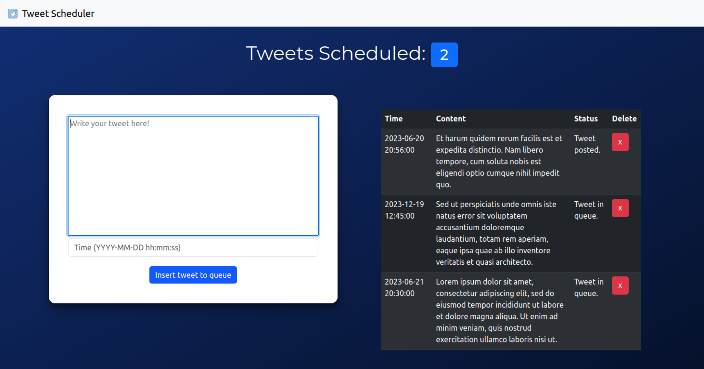

# Tweet Scheduler Web App
A Flask-based web application that allows users to schedule tweets. The app utilizes the Tweepy library for tweeting and the gspread library for storing tweet data in a spreadsheet. It provides a user-friendly interface for creating and managing tweet schedules.

## Features
- **Schedule Tweets**: Create and schedule tweets to be posted at specific dates and times.
- **Tweet Management**: View and delete scheduled tweets.
- **Automatic Tweet Posting**: A worker script (`tweet.py`) continuously runs in the background, checking the scheduled tweets, and automatically posts them at the specified times.
- **Spreadsheet Integration**: The app updates a spreadsheet using the gspread library, for the storage and tracking of tweet data.

## Getting Started
To use the Tweet Scheduler Web App, follow these steps:

1. Clone this repository to your local machine using the following command:
   ```bash
   git clone https://github.com/2spi/tweet-scheduler.git

2. Install the required dependencies by running the following command:
   ```bash
   pip install -r requirements.txt
3. Set up your Twitter API credentials by creating a .env file and adding the necessary details:
   ```makefile
    TWITTER_API_KEY=your_api_key
    TWITTER_API_SECRET=your_api_secret
    TWITTER_ACCESS_TOKEN=your_access_token
    TWITTER_ACCESS_TOKEN_SECRET=your_access_token_secret
4. Set up your Google Sheets API credentials. Store as `gsheet-credentials.json`.
5. Run the Flask app:
   ```bash
   export FLASK_APP=main/app.py
   flask run
6. Start the worker script (`tweet.py`):
   ```bash
   python tweet.py

